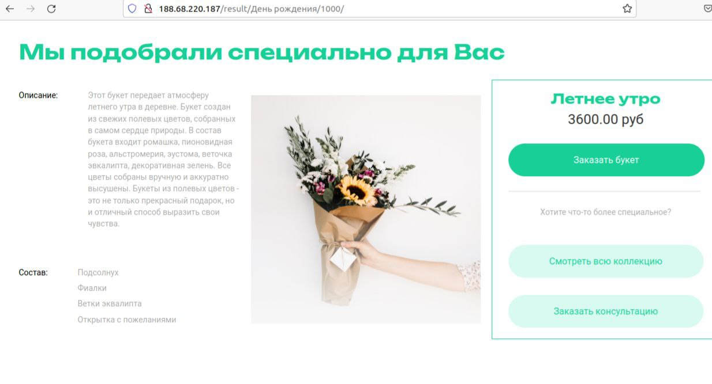
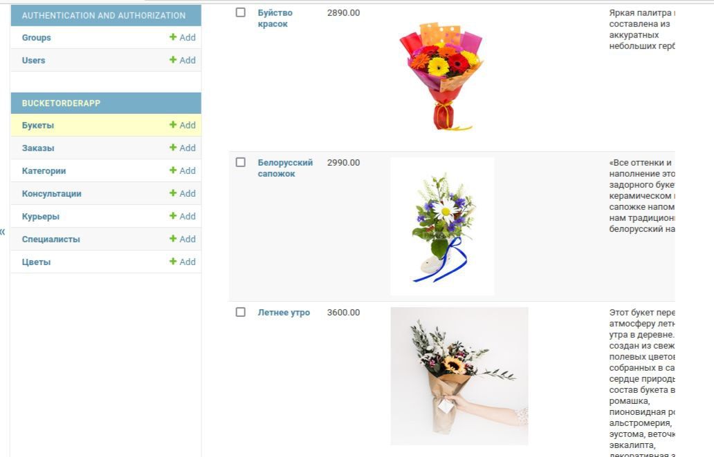

Это проект-сайт онлайн магазина по продаже цветов [https://flowershop/](http://188.68.220.187/).



На сайте присутсвует удобная админ панель. Вы можете легко добавить новые 
букеты, изменить описание, цену и картинки. Ссылка на 
[админ](http://188.68.220.187/admin/) часть.




## Установка

Используйте данную инструкцию по установке этого скрипта

1. Установить

```python
git clone https://github.com/HardRope/dvmn-flower-shop.git
```

2. Создайте виртуальное окружение:

```python
python - m venv venv
```

3. Активируйте виртуальное окружение:

```python
.\venv\Scripts\activate`  # for Windows
```

```python
source./.venv/bin/activate  # for Linux
```

4. Перейдите в `dvmn-flower-shop` директорию.

3. Установите зависимости командой ниже:

```python
pip install - r requirements.txt
```

4. Для доступа в админ панель, создайте супер юзера, из дериктории где лежит файл `manage.py`

```python
python3 manage.py createsuperuser
```

* Напишите имя
* Напишите емайл
* Придумайте пароль ( его не будет видно )
* Повторите пароль
* Если пароль слишком легкий, джанга попросит вас подтвердить его создание, нажмите `y`

5. Создайте файл с переменными окружения .env, находясь в `dvmn-flower-shop`, пример содержимого ниже:

```python
DEBUG=True
SECRET_KEY='django-insecure-000009%9s!&i06t)k+=99999#sjp66666_s$=jh*fghj!=og*0'
ALLOWED_HOSTS=127.0.0.1,localhost
DATABASE_ENGINE=django.db.backends.sqlite3
DATABASE_NAME=db.sqlite3
YOOKASSA_API_KEY=111
YOOKASSA_SHOP_ID=111
HOST_ADDRESS=127.0.0.1:8000 
```

6. Создайте миграции и базы данных командами ниже:

```python
python manage.py makemigrations
python manage.py migrate
```
7. Запустите сайт командой:

```python
python manage.py runserver
```

9. В браузере перейдите на странницу `http://127.0.0.1:8000`

